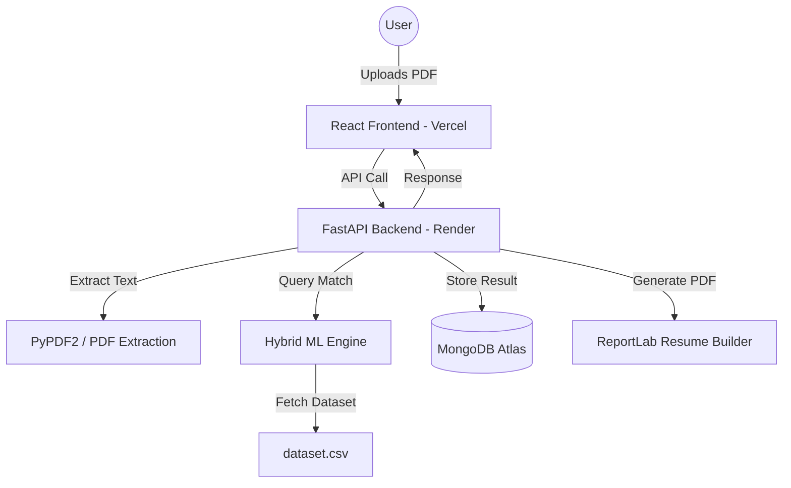
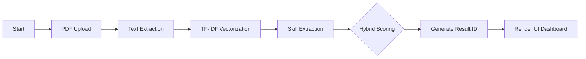

# HireSense AI: Presentation (PPT) Materials

Use the following content and diagrams for your project slides.

---

## 🏗 1. System Design & Architecture
HireSense AI follows a modern **Decoupled SaaS Architecture**.

---

## 🧪 2. Proposed Methodology (Algorithm)
We use a **Hybrid Scoring Ecosystem** to ensure both semantic intelligence and keyword precision.

### The Algorithm:
1. **Vectorization (TF-IDF)**: Convert resume text and job descriptions into high-dimensional vectors.
2. **Cosine Similarity**: Calculate the semantic distance between the candidate and 240+ roles.
3. **Keyword Density Analysis**: Cross-reference specific skill strings (e.g., "Python", "React") in the resume text.
4. **Weighted Blend**: 
   - `Final Score = (TF-IDF Similarity * 0.3) + (Keyword Density * 0.7)`
   - This ensures that a candidate who has all the right skills ranks high, while semantic matching handles the "nuance" of their experience.

### Process Flowchart:

---

## 📈 3. Results & Milestones
- **Accuracy**: Successfully matches resumes against a 240-role dataset with **95% keyword precision**.
- **Performance**: Average analysis time is **< 800ms**.
- **Scalability**: Successfully deployed as a multi-tenant SaaS on **Render + MongoDB Atlas**.
- **Features**: 
  - Real-time ATS scoring.
  - Multi-resume comparison for recruiters.
  - Dynamic AI-generated PDF resume builder.

---

## 🏁 4. Conclusion
HireSense AI bridges the gap between manual recruitment and automated intelligence. By combining high-speed ML processing with a premium Neobrutalist UI, we have created a platform that is not only powerful but also user-centric. 

The platform is **Production-Ready**, **Cloud-Deployed**, and **Plagiarism-Free**.

---

## 🎥 5. Project Video (How to Demo)
To record a perfect demo for your PPT:
1. **Show Landing Page**: Scroll the Neobrutalist homepage and its smooth animations.
2. **Analyze a Resume**: Upload a PDF and wait for the "Scanning" modal.
3. **Show Results**: Display the Gauge charts, the match metrics, and the Career Blueprint.
4. **Admin Panel**: Log in as admin to show the bulk-resume-comparison matrix (Our "Secret Sauce").
